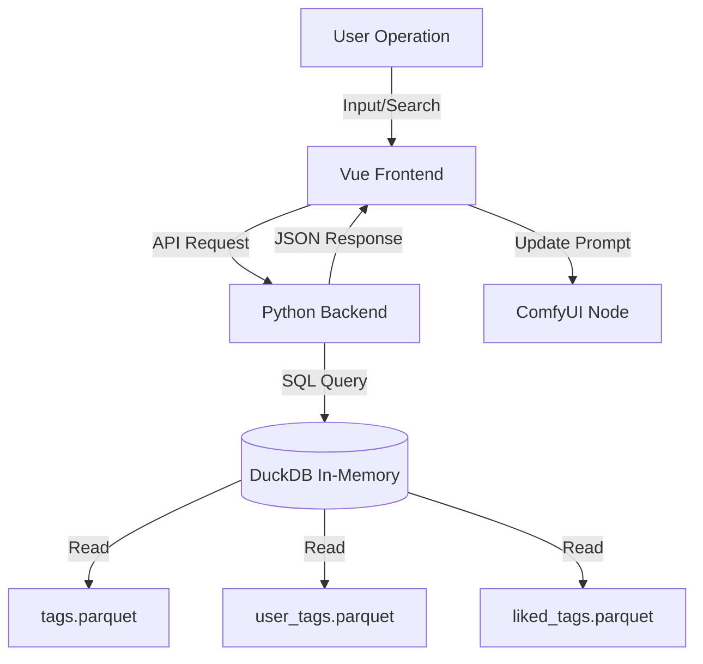

# ComfyUI Simple Prompt Design Document

## 1. Project Overview

**ComfyUI Simple Prompt** is an advanced prompt editing node designed specifically for ComfyUI. It aims to solve the pain points of traditional text input boxes when dealing with complex prompts, providing a WebUI-like visual editing experience while maintaining ComfyUI's fluidity.

Core Goals:
*   **Visual Editing**: Provides capsule-style tag displays that are easy to drag, delete, and adjust weights.
*   **High-Performance Data Retrieval**: Utilizes **DuckDB** and **Parquet** files to handle massive Danbooru tag data, achieving millisecond-level search and completion.
*   **Seamless Integration**: Functions as a custom ComfyUI node, integrating perfectly into existing workflows.
*   **Customization & Expansion**: Supports user-defined tags, favorite tags, and allows for data updates via the network.

## 2. System Architecture

The project adopts a decoupled frontend-backend architecture:

*   **Backend (Python)**: Responsible for data storage, retrieval APIs, and node logic.
*   **Frontend (Vue 3 + TypeScript)**: Responsible for UI interaction, state management, and communicating with the backend via API.

### 2.1 Backend Architecture (`simple_prompt/`)

The backend core has been refactored into the `simple_prompt` package, separating core business logic from the ComfyUI adaptation layer.

*   **Data Storage (DuckDB)**:
    Uses DuckDB's In-Memory database to query Parquet files directly from disk via `read_parquet`.
    *   **Layered Data Sources** (Priority from high to low):
        1.  `liked_tags.parquet` (Custom Data): User-bookmarked/liked tags.
        2.  `user_tags.parquet` (Custom Data): User-added custom tags.
        3.  `default_tags.parquet`: Pre-configured default tags.
        4.  `tags.parquet`: Main dataset containing 70k+ Danbooru tags.

*   **Key APIs** (Defined in `simple_prompt/comfyui/server.py` & `simple_prompt/api/handlers.py`):
    *   `GET /simple-prompt/tags/list`: Get tag list (supports pagination and search).
    *   `GET /simple-prompt/search-tags`: High-performance search (supports alias matching and category filtering).
    *   `POST /simple-prompt/add-custom-tag`: Add or modify a tag.
    *   `POST /simple-prompt/toggle-like-tag`: Favorite or unfavorite a tag.
    *   `POST /simple-prompt/update-tags`: Update data files from GitHub Releases.

### 2.2 Frontend Architecture (`src/`)

The frontend is built with **Vue 3** (Composition API) and bundled using **Vite**.

*   **Component Structure**:
    *   `App.vue`: Root component, mounted to the ComfyUI node's DOM element.
    *   `VisualTagArea.vue`: Visual tag display area, supporting drag-and-drop sorting and double-click weight adjustment.
    *   `TextEditor.vue`: Plain text editing area, supporting syntax highlighting and smart autocomplete.
    *   `TagSearchModal.vue`: Advanced search modal, providing filtering by category (Artist, Character, etc.).
    *   `SettingsModal.vue`: Settings panel for managing interface language, editing habits, etc.
    *   `TagManager.vue`: Data management panel for managing custom and bookmarked tags.

*   **Internationalization (i18n)**:
    Uses `vue-i18n`, supporting switching between English and Chinese (`locales/en/main.json`, `locales/zh/main.json`).

## 3. Core Feature Design

### 3.1 Data Retrieval and Completion
*   **Backend Implementation**: Leverages DuckDB's SQL engine to perform fuzzy matching via `ILIKE`.
*   **Alias System**: Supports Danbooru alias searching (e.g., searching "miku" can match "hatsune_miku"). This is implemented in SQL by expanding the `alias` array using `unnest`.
*   **Performance Optimization**: Parquet files are pre-sorted by `post_count`, and DuckDB queries prioritize returning high-frequency tags first.

### 3.2 Autocomplete
*   **Trigger Mechanism**: Triggered in real-time as you type in the text box, or explicitly using `Ctrl+Space`.
*   **Logic**: The frontend captures the word at the cursor position and sends it to the backend's `/simple-prompt/search-tags` endpoint. The backend returns a list of matches. Configurable to include or exclude aliases.

### 3.3 Tag Weight Adjustment
*   **From UI**: Double-click a visual tag capsule or use shortcuts (`Ctrl+Up/Down`) to adjust weights.
*   **Format**: Standard A1111 format `(tag:1.1)` or `(tag:0.9)`.
*   **Smart Parsing**: Automatically parses weight parentheses in the text into visual numeric values.

## 4. Data Flow Diagram

## 5. Directory Structure Explanation

*   `simple_prompt/`: Main Python backend source code.
    *   `core/`: Core business logic (Tags, Database).
    *   `api/`: API processing logic.
    *   `comfyui/`: ComfyUI node and Server adaptation.
*   `js/`: Compiled frontend code (generated by Vite).
*   `src/`: Frontend source code.
*   `data/`: Directory for Parquet data files.
*   `locales/`: Localization files.

## 6. Future Roadmap
*   Support for more prompt formats (e.g., NovelAI format).
*   Integration of richer image previews (when hovering over a tag).
