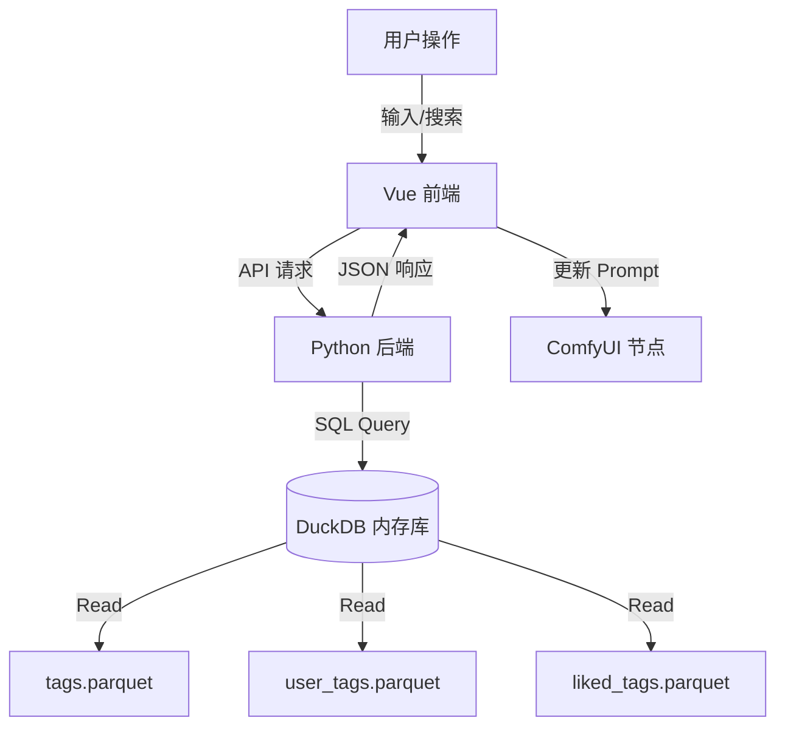

# ComfyUI Simple Prompt 设计文档

## 1. 项目概述

**ComfyUI Simple Prompt** 是一个专为 ComfyUI 设计的高级提示词编辑节点。它旨在解决传统文本输入框在处理复杂 Prompt 时的痛点，提供类似 WebUI 的可视化编辑体验，同时保持 ComfyUI 的流畅性。

核心目标：
*   **可视化编辑**：提供胶囊式的标签展示，易于拖拽、删除和权重调整。
*   **高性能数据检索**：利用 **DuckDB** 和 **Parquet** 文件处理海量 Danbooru 标签数据，实现毫秒级搜索和补全。
*   **无缝集成**：作为 ComfyUI 的自定义节点，完美融入现有工作流。
*   **自定义与扩展**：支持用户自定义标签、收藏标签，并允许通过网络更新数据。

## 2. 系统架构

项目采用前后端分离的架构：

*   **后端 (Python)**: 负责数据存储、检索 API 和节点逻辑。
*   **前端 (Vue 3 + TypeScript)**: 负责 UI 交互、状态管理和通过 API 与后端通信。

### 2.1 后端架构 (`SimplePrompt.py`)

后端核心是一个基于 `aiohttp` 的 API 服务，挂载在 ComfyUI 的 `PromptServer` 上。

*   **数据存储 (DuckDB)**:
    使用 DuckDB 的 In-Memory 数据库，通过 `read_parquet` 直接查询磁盘上的 Parquet 文件。
    *   **分层数据源**（优先级从高到低）：
        1.  `liked_tags.parquet` (Custom Data): 用户收藏/点赞的标签。
        2.  `user_tags.parquet` (Custom Data): 用户添加的自定义标签。
        3.  `default_tags.parquet`: 预置的默认标签。
        4.  `tags.parquet`: 包含 70k+ Danbooru 标签的主数据集。

*   **关键 API**:
    *   `GET /simple-prompt/tags/list`: 获取标签列表（支持分页、搜索）。
    *   `GET /simple-prompt/search-tags`: 高性能搜索（支持别名匹配、分类筛选）。
    *   `POST /simple-prompt/add-custom-tag`: 添加/修改 Tag。
    *   `POST /simple-prompt/toggle-like-tag`: 收藏/取消收藏 Tag。
    *   `POST /simple-prompt/update-tags`: 从 GitHub Release 更新数据文件。

### 2.2 前端架构 (`src/`)

前端使用 **Vue 3** (Composition API) 构建，利用 **Vite** 进行打包。

*   **组件结构**:
    *   `App.vue`: 根组件，挂载到 ComfyUI 节点的 DOM 元素上。
    *   `VisualTagArea.vue`: 可视化标签展示区，支持标签的拖拽排序、双击修改权重。
    *   `TextEditor.vue`: 纯文本编辑区，支持语法高亮、自动补全 (Autocomplete)。
    *   `TagSearchModal.vue`: 高级搜索模态框，提供按分类 (Artist, Character 等) 筛选的功能。
    *   `SettingsModal.vue`: 设置面板，管理界面语言、编辑习惯等。
    *   `TagManager.vue`: 数据管理面板，用于管理自定义和收藏的标签。

*   **国际化 (i18n)**:
    使用 `vue-i18n`，支持中英文切换 (`locales/zh/main.json`, `locales/en/main.json`)。

## 3. 核心功能设计

### 3.1 数据检索与补全
*   **后端实现**: 利用 DuckDB 的 SQL 引擎，通过 `ILIKE` 进行模糊匹配。
*   **别名系统**: 支持 Danbooru 别名搜索（例如搜 "hatsune miku" 可以匹配到 "hatsune_miku"）。在 SQL 中通过 `unnest(alias)` 展开数组进行匹配。
*   **性能优化**: Parquet 文件按 `post_count` 预排序，DuckDB 查询时优先返回高频标签。

### 3.2 自动补全 (Autocomplete)
*   **触发机制**: 在文本框输入时实时触发，或通过 `Ctrl+Space` 唤起。
*   **逻辑**: 前端捕获光标位置的单词，发送给后端 `/simple-prompt/search-tags`，后端返回匹配列表。支持配置是否匹配别名。

### 3.3 标签权重调整
*   **从 UI**: 双击可视化标签或使用快捷键 (Ctrl+Up/Down) 调整权重。
*   **格式**: 标准 A1111 格式 `(tag:1.1)` 或 `(tag:0.9)`。
*   **智能解析**: 能够自动将文本中的括号权重解析为可视化数值。

## 4. 数据流图

## 5. 目录结构说明

*   `SimplePrompt.py`: 后端入口与逻辑。
*   `js/`: 编译后的前端代码 (由 Vite 生成)。
*   `src/`: 前端源码。
*   `data/`: 存放 Parquet 数据文件。
*   `locales/`: 语言文件。

## 6. 未来规划
*   支持更多的 Prompt 格式（如 NovelAI 格式）。
*   集成更丰富的图像预览功能（当鼠标悬停在标签上时）。
